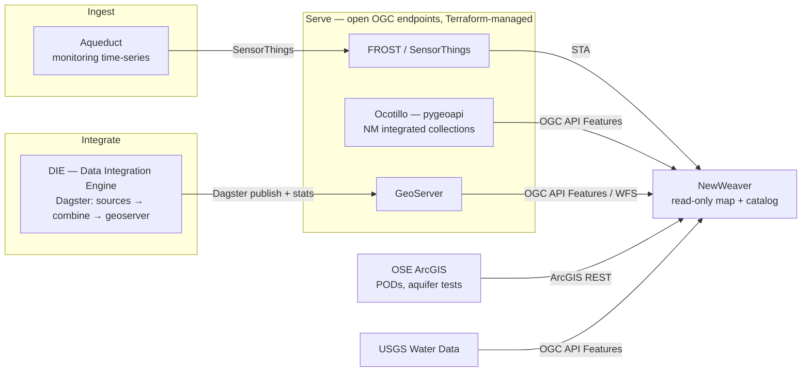

# Why NewWeaver

> **Naming:** *NewWeaver* is an **internal codebase name only**. To the public it is **Weaver**, and it will be served at [`weaver.newmexicowaterdata.org`](https://weaver.newmexicowaterdata.org) — replacing the legacy app there. It is **currently hosted at [`newweaver.newmexicowaterdata.org`](https://newweaver.newmexicowaterdata.org)** during the transition. This doc uses "NewWeaver" to distinguish the new app from the legacy one.

## TL;DR

- **NewWeaver** is the public, read-only web map that replaces the legacy Weaver at `weaver.newmexicowaterdata.org`.
- It is a **client-only display surface** — no backend, no accounts, no private data, no ingest. It reads live from open OGC service standards.
- One value prop: **always-fresh, multi-agency, integrated water-data products on one map** — the window onto the DataServices stack, not more plumbing.
- Adding a dataset is **one catalog entry**, not a source-specific code project.
- It **shares UI with the rest of DataServices** through the DataServicesDesignSystem registry — build a primitive once, reuse it everywhere.

## A note on framing

This document is not a defense. NewWeaver is the direction that was set; this is the shared picture of *what it is and why*, written down so the team is working from the same map. If parts of the comparison or the ecosystem framing don't match your understanding, that's exactly the input worth having — open a comment on the PR. Everything below is grounded in the repo (README, SPEC, `src/config.ts`, the codebase map) and linked so you can check it. Where a claim rests on a team fact rather than the code, it says so.

## What NewWeaver is

A display surface: four typed data adapters, one MapLibre map, a config-driven layer catalog, and detail/inspect views. That's the whole shape. ([README.md](../README.md#architecture))

- **No backend of its own.** Static hosting plus upstream APIs. Every client fetches a third-party service directly; there is no Weaver-owned API or datastore. ([docs/codebase-map.md](codebase-map.md#backend--no-weaver-owned-backend-confirmed-cc2--oo4), [weaver-architecture-facts])
- **Standards-based adapters, not source-specific code.** Four thin clients cover every source: OGC API Features, OGC SensorThings (STA), OGC WFS, and ArcGIS REST. ([src/clients/](../src/clients/))
- **Config-driven catalog.** Endpoints live in [`src/config.ts`](../src/config.ts) (all `VITE_*`-overridable); datasets live in `src/catalog/layers.ts`. **Adding a dataset = a new catalog entry** that names its collection and transport — no new fetch/parse/render code. ([README.md](../README.md#architecture))

The upstream data plumbing — how monitoring data lands in FROST, how DIE builds the integrated products — is deliberately **out of scope**. NewWeaver references those systems; it does not reimplement them. ([README.md](../README.md#status))

## What must be kept — the functionality Weaver users rely on

A rewrite is only a win if it **preserves what already works**. The legacy Weaver earns its usage on a few core jobs, and these are non-negotiable requirements for NewWeaver, not nice-to-haves:

- **View a hydrograph of up-to-date data** — pick a monitoring location, see its time-series (water level / depth-to-water / chemistry) plotted from *live* data, not a stale export. This is a primary reason people open Weaver at all.
- **Download the data behind the hydrograph** — get the underlying observations as a file (CSV) to use in their own analysis.
- **Share a link to a specific view** — send someone a URL that opens the exact location and its hydrograph, so they see current data without hunting for it.
- Plus the map itself: browse monitoring networks, inspect a point's attributes, filter/search.

> **Why this section exists:** at a recent hydrology management meeting, **AMP** raised a concrete pain point — *they can't send a user a link to view a hydrograph of up-to-date data*. Viewing hydrographs and downloading their data is a big part of why people use Weaver, so any replacement has to nail it.

**Where NewWeaver stands today** — all three are already implemented and must stay that way:

| User need | NewWeaver status | Backing code |
|---|---|---|
| Hydrograph of live data | ✅ Monitoring location → datastreams → ECharts time-series, fetched live from SensorThings | [`DatastreamChart.tsx`](../src/components/app/DatastreamChart.tsx), [`InspectPanel.tsx`](../src/components/app/InspectPanel.tsx) |
| Download the observations | ✅ Time-series CSV export gathers observations across the selected datastreams | [`src/lib/export/timeSeries.ts`](../src/lib/export/timeSeries.ts) |
| Shareable link to that view | ✅ Selection (`<layerId>~<featureId>`), visible layers, and extent are URL-encoded → every view is a shareable, Back-navigable link | [`src/lib/urlState.ts`](../src/lib/urlState.ts) |

So AMP's exact ask — a link that opens a specific monitoring point's up-to-date hydrograph, with the data downloadable — is **already achievable** in NewWeaver via URL-encoded selection + the live datastream chart + CSV export. The job now is to keep these paths first-class (and easy to reach — cf. [SPEC §V9](../SPEC.md), export reachable from a narrowed result), verify them against real AMP locations, and make the shareable-hydrograph link obvious in the UI. Treat any regression here as a release blocker.

## Old Weaver → NewWeaver

The pain points below (left column) are the ones the team hit with the legacy app; the right column is what the new architecture does instead.

| Old Weaver | NewWeaver |
|---|---|
| **PrimeReact**, fought at every customization | **DataServicesDesignSystem** (vendored shadcn/radix) — own the source, restyle freely |
| **Duplicated multi-agency integration logic** — Weaver re-did data integration that DIE already owns | **DIE owns integration**; Weaver reads the finished integrated products live. No duplicate logic. |
| **Bespoke, per-source integration code** | **OGC standards** — four adapters cover all sources; a new source is config, not a code project |
| **Auth/authorization surface** — a private section to build, secure, and maintain | **No auth, no private data.** With Ocotillo serving the collections, Weaver needs no private section at all. |
| **Snapshot / stale exports** | **Live reads** — DIE/Ocotillo publish, Weaver reads; nothing to re-export |
| **One-off UI**, maintained per app | **Shared design system** — UI built once, reused across DataServices apps |

Net effect: NewWeaver carries far less code and far less operational surface. It has no auth to secure, no integration logic to keep in sync with DIE, and no export pipeline to babysit — because each of those jobs now lives in the component that owns it.

## The DSDS angle

UI lives in **DataServicesDesignSystem (DSDS)** — a shared shadcn registry — and NewWeaver has a two-way relationship with it:

- **Contributes** generic primitives *up* to the registry: basemap-selector, layer-selector, field-value, filter-controls, plus additive syncs to navbar/table/accordion and generalized onboarding-tour / top-loading-bar. ([dsds-component-port])
- **Consumes** those primitives *back* from the registry via `components.json` → the `@dataservices` namespace. The app's own copies were deleted and repointed at the registry versions. ([dsds-component-port])

The line is deliberate: **generic primitives go to DSDS; the 16 app-coupled components stay in the app** (AppShell, MapView, InspectPanel, AttributeTable, LocationSearch…) — they're bound to `@/catalog`, `@/clients`, `@/lib/*` and *are* the app. ([dsds-component-port])

Why it matters: UI work is done **once** and reused across every DataServices app. No design drift, no re-implementing a table or a layer selector per project, and the app keeps only what is genuinely domain-specific.

## Ecosystem fit

NewWeaver is one component in a pipeline with clean seams. Each system owns its job; NewWeaver is the window, not the plumbing.

- **Aqueduct** ingests monitoring time-series → publishes to **FROST / SensorThings**.
- **DIE (Data Integration Engine)** builds the multi-agency integrated products and nightly stats. It's a Python tool (`nmuwd`) whose **Dagster** orchestration runs a `sources → combine → geoserver` asset graph that **publishes each product to GeoServer**. ([DIE `orchestration/`](https://github.com/DataIntegrationGroup/DataIntegrationEngine) — `definitions.py`, `resources/geoserver.py`)
- **Ocotillo** is the pygeoapi deployment hosting the NM integrated collections.
- **GeoServer** (the serving layer) is **managed via Terraform**, so the infrastructure NewWeaver reads from is reproducible and version-controlled.
- **NewWeaver** consumes all of it **live** over open standards — OGC API Features, SensorThings, WFS, ArcGIS REST. ([src/config.ts](../src/config.ts), [docs/codebase-map.md](codebase-map.md#backend--no-weaver-owned-backend-confirmed-cc2--oo4))

The seam is the point: because the contract between components is a **public OGC endpoint**, each side evolves independently, and the same endpoints external GIS tools consume are the ones NewWeaver reads.

> Aqueduct → FROST and DIE → pygeoapi live in other repos and are referenced only. ([README.md](../README.md#status))

## Why hosted DIE beats "everyone runs DIE locally"

DIE started as a command-line tool: `pip install nmuwd`, then `die weave …` writes integrated GeoJSON to a **local output directory** on your machine. ([DIE README](https://github.com/DataIntegrationGroup/DataIntegrationEngine)) That works for a Python-comfortable analyst, but as *the* way to get integrated data it has hard limits. The hosted pipeline — **Dagster runs DIE on a schedule → publishes to GeoServer + GCS → NewWeaver and any GIS client read live** — removes them.

| Everyone runs DIE locally | Hosted: Dagster → GCS/GeoServer → NewWeaver |
|---|---|
| **Duplicated compute** — every user re-runs the same multi-agency integration on their own machine | **Computed once, centrally.** Dagster runs the `sources → combine → geoserver` graph on a cron (`0 6 * * *` default); everyone consumes the same output. ([`orchestration/definitions.py`](https://github.com/DataIntegrationGroup/DataIntegrationEngine)) |
| **No single source of truth** — results differ by who ran it, when, and which `nmuwd` version | **One canonical product set.** Published to GeoServer + versioned dated snapshots in GCS (`gs://…/products/{id}/{date}.geojson` + a `latest`). ([`orchestration/resources/gcs.py`](https://github.com/DataIntegrationGroup/DataIntegrationEngine)) |
| **Stale the moment it finishes** — a local export is a snapshot; refresh = re-run | **Always fresh** — the nightly job republishes; readers just re-fetch. |
| **Gatekept** — needs Python, a working env, API keys, and CLI know-how | **Zero setup for the reader.** A web map for non-experts; open OGC endpoints for devs and desktop GIS. No local Python. |
| **Not shareable / not discoverable** — output is files on one laptop | **A URL.** Every view is a live, shareable link; the same endpoints external tools consume. |
| **No observability** — a failed local run is your problem to debug | **Monitored pipeline** — per-source and geoserver assets soft-fail as red asset checks in Dagster; reproducible infra via Terraform. ([DIE `orchestration/AGENTS.md`](https://github.com/DataIntegrationGroup/DataIntegrationEngine)) |

The point isn't that the CLI was wrong — it's the right engine. The shift is **who runs it and where the output lives**: from *N users each producing a private, divergent, instantly-stale copy* to *one scheduled run producing a canonical, versioned, live-served product* that NewWeaver is simply a window onto. That inversion is what makes "always fresh, multi-agency, integrated" true for everyone, not just people who can run Python.

## Core value prop, expanded

- **Always fresh.** No manual exports, no snapshots. DIE publishes; NewWeaver reads live on every page load. Even the home-dashboard counts and activity feed come from a nightly DIE-written stats JSON, read read-only — Weaver computes none of it. ([SPEC.md §V13–V14](../SPEC.md), [src/config.ts `STATS_URL`](../src/config.ts))
- **Multi-agency.** One surface over state, local, and federal networks — nine STA agency networks plus the Ocotillo integrated collections, OSE, and USGS. ([weaver-architecture-facts], [docs/codebase-map.md](codebase-map.md#layer-catalog-srccataloglayersts))
- **Integrated.** The headline products are DIE's per-location integrated summaries, not raw single-source dumps.

## The planning dashboard

Beyond the map, NewWeaver ships a **Regional water-planning decision-support dashboard** at `/planning` — the clearest demonstration of what the integrated products unlock. ([src/components/site/RegionalPlanning.tsx](../src/components/site/RegionalPlanning.tsx), [src/lib/planning.ts](../src/lib/planning.ts))

- **Pick a region** — county, PWS (public water system), or basin — and the page rolls every well inside it into the summary statistics a water manager actually needs: how much is monitored, where water levels sit against their historical range, which way the trend points, depletion risk, seasonal swing, and drinking-water quality (MCL exceedance). ([src/catalog/regions.ts](../src/catalog/regions.ts), [src/lib/planning.ts](../src/lib/planning.ts))
- **Powered by DIE's integrated `die:` per-well summary products**, read live from GeoServer over OGC API Features / WFS — bbox-filtered on the server, then point-in-polygon refined client-side. ([src/lib/planning.ts](../src/lib/planning.ts))
- **Still client-only.** It reads the integrated products directly; it never depends on the map page's cached layers or the nightly stats file. The heavy analysis already happened in DIE — the dashboard just aggregates and charts (ECharts) with CSV export. ([src/lib/planning.ts](../src/lib/planning.ts))

This is the value prop made concrete: because DIE publishes finished integrated products, a decision-support surface is a **read + aggregate**, not a second integration engine.

## What it unlocks

- **New dataset in hours, not weeks** — one catalog entry over an existing standards endpoint.
- **Reuse across apps** — every generic UI improvement flows through DSDS to the rest of DataServices.
- **External interoperability** — because the transport is open OGC, desktop GIS and third-party tools consume the exact same endpoints NewWeaver does. ([SPEC.md §C4](../SPEC.md))

## Get involved

- **Run it** — `pnpm install && pnpm dev` (Vite dev server); `pnpm build` typechecks + builds. ([README.md](../README.md#develop))
- **Add a layer** — add an entry to `src/catalog/layers.ts` naming its collection id, section, and transport; point at a new endpoint in [`src/config.ts`](../src/config.ts) if needed. No source-specific code.
- **Change behavior** — specs are Gherkin in [`features/`](../features/), written before implementation; run `pnpm test:bdd`. ([README.md](../README.md#specs-first))
- **Improve shared UI** — generic primitives go through DSDS ([DataServicesDesignSystem](https://github.com/DataIntegrationGroup/DataServicesDesignSystem)); app-coupled components stay in `src/components/app/`. ([dsds-component-port])

## Glossary

| Term | What it is |
|---|---|
| **Aqueduct** | Ingest pipeline for monitoring time-series → publishes to FROST. |
| **DIE** | Data Integration Engine — Python tool (`nmuwd`) that builds the multi-agency integrated products and nightly stats. |
| **Dagster** | The orchestrator running DIE's `sources → combine → geoserver` asset pipeline that publishes products to GeoServer. |
| **Terraform** | Infrastructure-as-code managing the GeoServer serving layer — reproducible, version-controlled infra. |
| **Ocotillo** | pygeoapi deployment hosting the NM integrated OGC API Features collections. |
| **DSDS** | DataServicesDesignSystem — the shared shadcn/radix component registry NewWeaver contributes to and consumes from. |
| **FROST / STA** | FROST is an OGC **SensorThings API** server; STA serves monitoring locations + time-series datastreams. |
| **OGC API Features** | Modern REST standard for vector collections (`/collections/{id}/items`); served by pygeoapi, GeoServer, and USGS Water Data. |
| **WFS** | OGC Web Feature Service — the older vector standard; still supported, no longer the default transport for the integrated products. |
| **ArcGIS REST** | Esri Feature Service query API; used for OSE Points of Diversion and aquifer test wells. |
| **pygeoapi / GeoServer** | Servers that expose the integrated products as OGC API Features (and WFS). |
| **PWS** | Public Water System — one of the region kinds (county / PWS / basin) the planning dashboard summarizes. |
| **MCL** | Maximum Contaminant Level — the drinking-water quality threshold the planning dashboard flags exceedances against. |
| **`die:` products** | DIE's integrated per-well/per-location summary layers (water-level status, trends, depletion, recency, seasonal amplitude, MCL exceedance). |

---

*Sources: [README.md](../README.md), [SPEC.md](../SPEC.md), [docs/codebase-map.md](codebase-map.md), [src/config.ts](../src/config.ts). DIE's Dagster publish pipeline is grounded in the DataIntegrationEngine repo (`orchestration/`). Some framing (legacy pain points, Aqueduct ingest, the Terraform-managed GeoServer) rests on team knowledge, not any repo checked here — correct anything that's off.*
